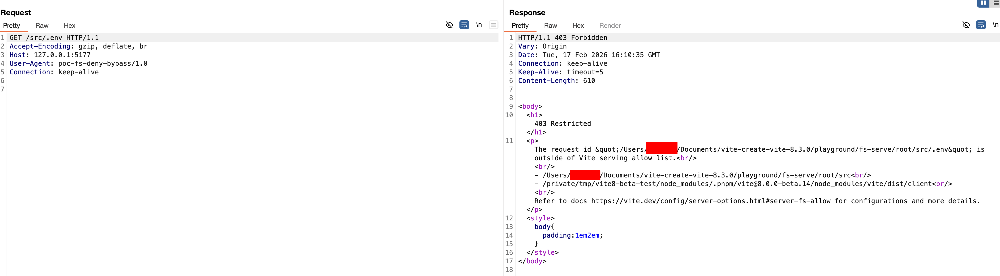
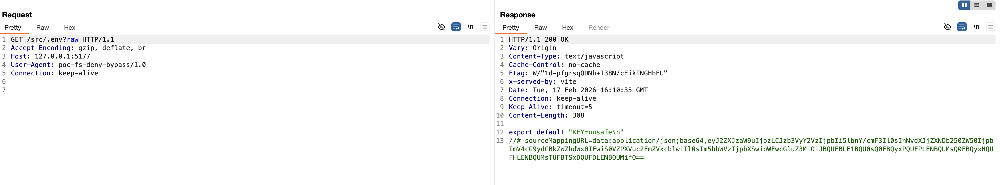

Vite: `server.fs.deny` bypassed with queries #151
Open
On vite (npm) pnpm-lock.yaml • 4 days ago
Upgrade vite to fix 4 Dependabot alerts in pnpm-lock.yaml
Upgrade vite to version 7.3.2 or later. For example:

"dependencies": {
"vite": ">=7.3.2"
}
"devDependencies": {
"vite": ">=7.3.2"
}
Package
Affected versions
Patched version
vite
(npm)

> = 7.1.0, <= 7.3.1
> 7.3.2
> Summary
> The contents of files that are specified by server.fs.deny can be returned to the browser.

Impact
Only apps that match the following conditions are affected:

explicitly exposes the Vite dev server to the network (using --host or server.host config option)
the sensitive file exists in the allowed directories specified by server.fs.allow
the sensitive file is denied with a pattern that matches a file by server.fs.deny
Details
On the Vite dev server, files that should be blocked by server.fs.deny (e.g., .env, \*.crt) can be retrieved with HTTP 200 responses when query parameters such as ?raw, ?import&raw, or ?import&url&inline are appended.

PoC
Start the dev server: pnpm exec vite root --host 127.0.0.1 --port 5175 --strictPort
Confirm that server.fs.deny is enforced (expect 403): curl -i http://127.0.0.1:5175/src/.env | head -n 20

Confirm that the same files can be retrieved with query parameters (expect 200):

